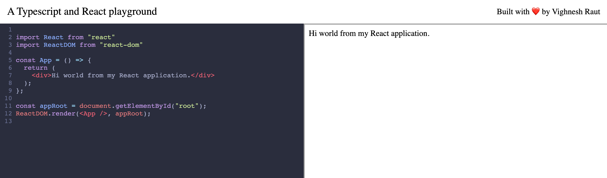

<h1 style="padding: 20px; background: pink; border: 1px solid red; border-radius: 10px;">
  PERMANENTLY MOVED HERE: <a href="https://github.com/vighnesh153/vighnesh153-monorepo/tree/main/nodejs-tools/nodejs-lib/tsx-bundler">Repository Link</a>
</h1>

---

# Typescript and React playground

[Visit the playground by clicking here](https://tsx.vighnesh153.com/)

An interactive, browser-based, coding environment. Following 
are the primary features of this project:

* **In-browser code transpiling** and **bundling**
* Leverage **ESBuild's Web Assembly** to run a code bundler 
directly in the browser at lightning-fast speeds
* **Import any NPM module** (which works in browser) directly in 
the editor and start using it
* Safely **execute user-provided code** directly in browser
* **Secure the app** against potential security exploits
* **Run a code editor** directly in the browser

